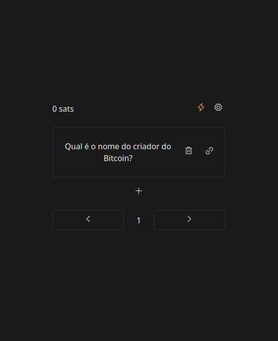

# Satoshi Quiz SaaS - Rewarding Quiz Platform with Sats

This is the user interface (UI) for the Satoshi Quiz platform. It offers a wide range of features so that users can manage their Quizzes efficiently. With this UI, it is possible to create new Quizzes, list the existing ones, delete them and even finance the sats portfolio directly within the application. With an intuitive and functional interface, users can enjoy a practical and convenient experience when using the Satoshi Quiz platform.

### Customization of Quizzes Parameters

Want to customize your Quizzes? No problem! Just add the
parameters below in the query:

- `?bg=red`: This parameter allows you to change the background color of the Quiz to red.
- `?colorButton=red`: Use this parameter to color Quizzes buttons.
- `?bgButtonCorrectAnswer=yellow`: This parameter is responsible for changing the background color when the user answers correctly.
- `?user=XYZ`: Use this parameter to pass the Memberstack's user identifier, preventing other users from receiving funds other than the users registered in the Memberstack configured in the account.

Example: https://localhost:58341/71e27272-aab2-41f5-b72c-6638fe2b0aed?user=123782X8SA9DASX&bg=red
